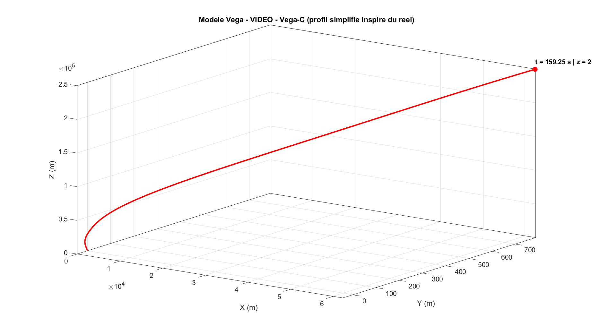
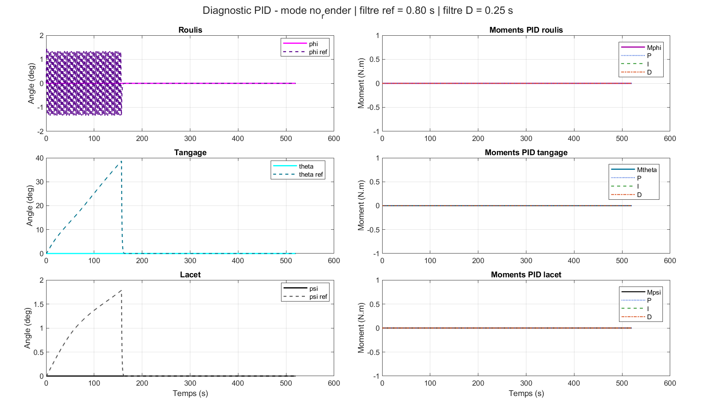
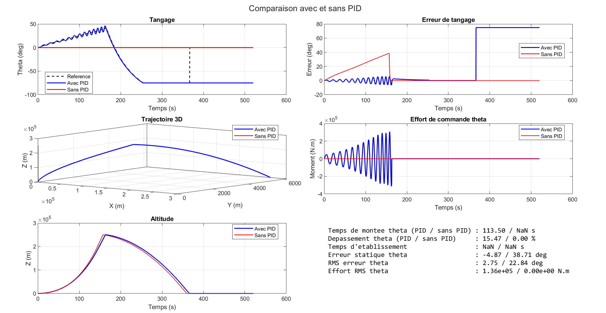
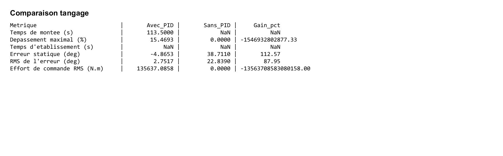

# Vega_Simulation

**Resume scientifique**  
Ce depot presente des simulations 3D sous MATLAB d'un vehicule propulse, depuis un modele generique jusqu'a un modele inspire du lanceur Vega-C. Il inclut des versions sans PID et une version avec regulation d'attitude par PID, ainsi qu'un script de comparaison directe entre les deux approches.

Simulation MATLAB de modeles 3D pour l'etude de la dynamique d'un vehicule propulse :

- `modele_final_3D` : modele generique final
- `modele_vega` : modele inspire du lanceur Vega-C
- `modele_vega_PID_ok` : modele Vega-C avec commande PID, diagnostics et exports
- `compare_pid_vs_no_pid` : comparaison automatique avec/sans PID, figures, tableaux, video et export Excel

Ce depot a pour objectif de fournir une base de simulation compacte, lisible et reproductible pour l'analyse de trajectoires 3D avec poussee, masse variable, trainee aerodynamique et attitude.

## Apercu

Le projet rassemble trois niveaux de modelisation complementaires :

- un modele academique generique, utile pour l'analyse methodologique
- un modele calibre sur des ordres de grandeur inspires de Vega-C, utile pour une interpretation plus proche d'un lanceur spatial reel
- un modele Vega-C avec regulation PID et outils de comparaison, utile pour l'analyse de la stabilisation en boucle fermee

Les deux scripts produisent automatiquement des figures, des fichiers de log et, selon le mode choisi, des videos exportees dans le dossier `out/`.

## Apercu visuel

### Modele Vega avec separation de satellite



### Diagnostic PID du modele Vega



### Comparaison avec et sans PID





## Contenu du depot

```text
Vega_Simulation/
|- src/
|  `- controle_pid/
|     |- modele_final_3D.m
|     |- modele_vega.m
|     `- modele_vega_PID_ok.m
|- out/
|  |- images/
|  |  |- compare_pid_dashboard.png
|  |  |- compare_pid_pitch_table.png
|  |  |- compare_pid_mission_table.png
|  |  `- modele_vega_PID_ok_pid.png
|  |- logs/
|  `- videos/
|     `- compare_pid_vs_no_pid.mp4
|- compare_pid_vs_no_pid.m
|- setup_paths.m
|- .gitignore
`- README.md
```

## Modeles inclus

### `modele_final_3D`

Modele 3D generique sans PID destine a servir de reference academique.

Principales caracteristiques :

- trajectoire propulsee simplifiee
- masse variable
- trainee aerodynamique
- dynamique d'attitude en 3D
- export des resultats en image, log et video

### `modele_vega`

Modele 3D sans PID inspire du lanceur Vega-C.

Principales caracteristiques :

- vehicule multi-etages simplifie
- parametres de masse, geometrie et poussee inspires du reel
- profil d'ascension 3D avec separation de satellite
- retombee balistique du lanceur apres largage
- poursuite de la trajectoire du satellite en espace apres l'impact du lanceur
- export des resultats en image, log et video

### `modele_vega_PID_ok`

Modele 3D inspire du lanceur Vega-C avec regulation d'attitude par PID.

Principales caracteristiques :

- suivi de consignes d'attitude sur les axes `phi`, `theta` et `psi`
- regulation PID avec filtrage des consignes et de la derivee
- calcul et export des diagnostics PID
- export des termes de commande et des erreurs pour analyse
- production d'images, de logs, de videos et de fichiers exploitables pour comparaison

### `compare_pid_vs_no_pid`

Script de comparaison automatique entre le mode avec PID et le mode sans PID.

Principales sorties :

- tableaux comparatifs des performances
- dashboard PNG de comparaison
- video de comparaison cote a cote
- fichier Excel contenant entrees, sorties et series temporelles

## Prerequis

- MATLAB
- acces aux fonctions standards de calcul numerique et de visualisation

Le projet ne depend d'aucune toolbox specifique supplementaire au-dela de l'environnement MATLAB utilise pour les scripts et les exportations.

## Demarrage rapide

Depuis MATLAB :

```matlab
run('setup_paths.m')
```

Exemples de lancement :

```matlab
modele_final_3D('preview')
modele_vega('preview')
modele_vega_PID_ok('preview')
```

Pour un calcul rapide sans rendu graphique :

```matlab
modele_final_3D('no_render')
modele_vega('no_render')
modele_vega_PID_ok('no_render')
```

Pour generer une video :

```matlab
modele_final_3D('video')
modele_vega('video')
modele_vega_PID_ok('video')
```

Pour lancer la comparaison avec et sans PID :

```matlab
results = compare_pid_vs_no_pid('no_render')
```

## Modes disponibles

Les deux scripts acceptent les modes suivants :

- `debug`
- `no_render`
- `preview`
- `video`
- `ultra_light`
- `full`

Ces modes permettent d'ajuster le temps de simulation, le niveau de rendu et l'export des videos.

## Resultats generes

Les sorties sont enregistrees automatiquement dans `out/` :

- `out/images/` : figures PNG
- `out/logs/` : resumes textuels et fichiers de presentation
- `out/videos/` : animations MP4

Exemples de fichiers produits :

- `out/images/modele_final_3D.png`
- `out/images/modele_vega.png`
- `out/images/modele_vega_PID_ok_pid.png`
- `out/images/compare_pid_dashboard.png`
- `out/images/compare_pid_pitch_table.png`
- `out/images/compare_pid_mission_table.png`
- `out/logs/modele_final_3D.txt`
- `out/logs/modele_vega.txt`
- `out/logs/modele_vega_PID_ok_pid.txt`
- `out/logs/compare_pid_summary.txt`
- `out/logs/compare_pid_vs_no_pid.xlsx`
- `out/videos/modele_final_3D.mp4`
- `out/videos/modele_vega.mp4`
- `out/videos/compare_pid_vs_no_pid.mp4`

## Resultats de reference

### Modele final 3D

- temps de vol : `19.00 s`
- portee horizontale : `2306.52 m`
- altitude maximale : `12234.30 m`
- fin de simulation : `target_altitude_reached`

### Modele Vega

- temps de vol : `362.50 s`
- portee horizontale : `155217.61 m`
- altitude maximale : `250091.76 m`
- fin de simulation : `satellite_deployed_then_ground_impact`
- separation du satellite : `159.25 s`
- altitude de separation : `250091.76 m`
- satellite poursuivi visuellement en espace apres la retombee du lanceur

### Comparaison avec et sans PID

- RMS de l'erreur en tangage avec PID : `2.752 deg`
- RMS de l'erreur en tangage sans PID : `22.839 deg`
- amelioration du suivi en tangage : environ `88 %`
- effort de commande reste inferieur a la limite de saturation du modele

## Portee scientifique

Le depot permet de comparer :

- une modelisation generique de vehicule propulse en 3D
- une adaptation appliquee a un cas inspire du secteur spatial
- une commande en boucle ouverte et une commande en boucle fermee par PID
- un scenario de deploiement simplifie de satellite avec retombee du lanceur

Il constitue ainsi une base utile pour :

- l'analyse academique de la dynamique du vol
- la production de figures et de supports de presentation
- l'illustration d'un passage progressif d'un modele generique a un modele plus realiste

## Limites

Les deux modeles restent volontairement simplifies :

- atmosphere simplifiee
- trainee basee sur un coefficient constant
- poussees modelisees par valeurs moyennes
- absence de mecanique orbitale detaillee

Dans le cas du modele PID, la commande reste egalement simplifiee :

- moments de commande appliques directement sans modele complet d'actionneur
- guidage d'attitude base sur des consignes simplifiees
- objectif principalement pedagogique et comparatif

Les resultats doivent donc etre interpretes comme des ordres de grandeur scientifiquement coherents, et non comme des predictions industrielles exactes.

## Auteur

Felix Nimy
